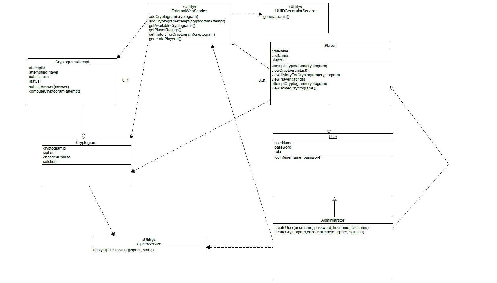
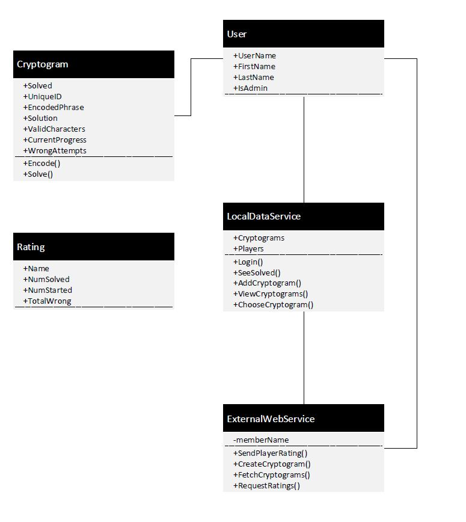
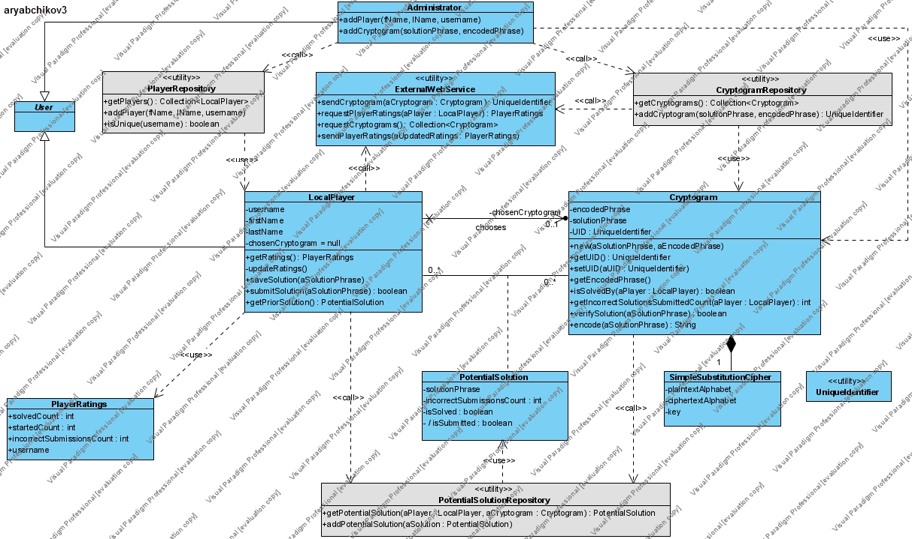
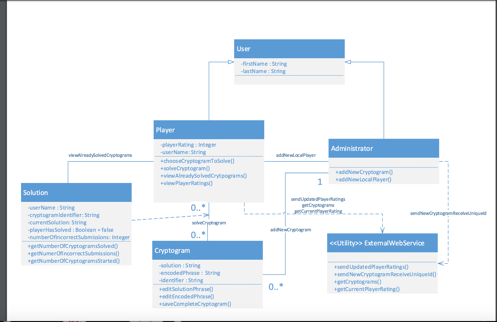
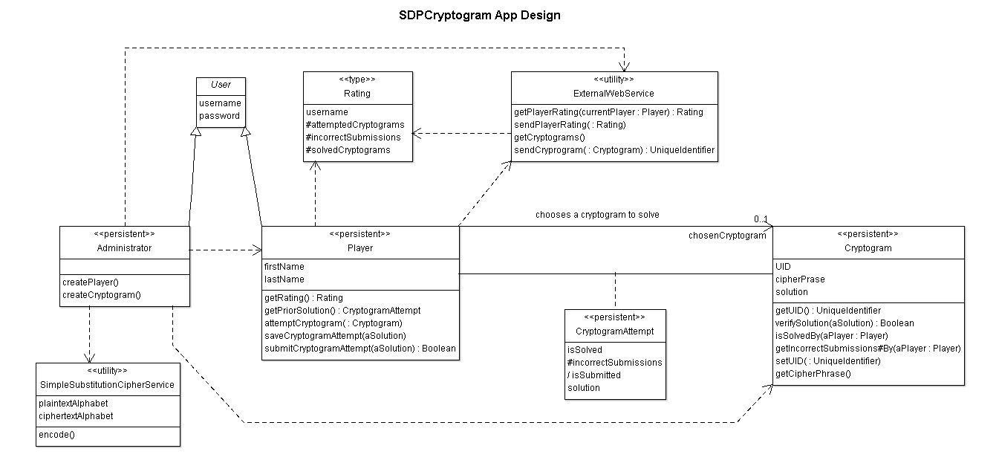

# Design 1 (Nick Marsh)

_Main Pros:_ Clean, covers requirements, minimal implementation detail present.  
_Main cons:_ Over-infers, not enough detail in some areas, specifically with regards to the EWS and player rankings, a couple UML syntax errors  
_Other notes:_ Primary design difference with Anton's design is how we represent an attempt at a cryptogram. 

# Design 2 (Justin Allen)

_Main Pros:_ Very simple design, could make a good base to work from. Ratings class is helpful.  
_Main Cons:_ No multiplicity. Missing a class relating to the attempt on a cryptogram. No hierarchy for user / administrator / player.  
_Other Notes:_ memberName attribute which is default placed by visio left in.

# Design 3 (Anton Ryabchikov)

_Main Pros:_ Covers essential domain entities, explicitly states contract on methods, described with sufficient details in supplementary document

_Main Cons:_ Implementation-biased; inclusion of repository classes, PlayerRatings structures, etc. is arguable at design-time; incorrectly models cryptographic algorithm as part of cryptogram (instead of providing its services to administrator before the cryptogram is ever created)

_Other notes:_ The design has much in common with Nick's design (very similar nomenclature of domain classes) with major differences in class responsibilities (e.g. EWS, cryptographic algorithm), approach to model player's attempts on cryptograms, user classes hierarchy properties as well as treatment of non-local players.

# Design 4 (Rohan Shroff)

_Main Pros:_ This design centers on the player and also covers a lot of the future method categories that need to be used. Although, the solution class may be a bit complex when rendering, this can be changed to fit the overall model of the design. 

_Main Cons:_ This has a mention of a superuser or "admin" per say for access. But I feel looking at admin and player to addNewLocalPlayer may be more complex then it seems. The Cryptogram design may also be a little to simple to handle more complex answers. 

Other Notes: The overall design is good, but using some multiplicity may do some good. 

# Team Design

The figure above depicts the design as it arose out of the team discussion. 

Elaborating over the new design the team strives to retain a balance between clarity and expressiveness of mostly "domain-oriented" designs and rigor of more "implementation-oriented" ones. Thus, the design proposed is a combination of features present in individual designs.

Clearly, all individual designs correctly capture major domain categories (e.g. User, Player, Cryptogram, etc.) so they were easily incorporated into team design with minor terminological adjustments.

Some entities, like UniqueIdentifier (Design #1 and #3) or repository/datastore classes (Design #2 and #3), were eliminated from team design as being implementation-specific or biasing the design towards a particular ORM scheme.

The notion of Rating structure (Design #2 and #3) has been reworked to serve as a specification of player ratings interchange format with the remove web service (accessed via local ExternalWebService proxy).

The responsibilities of the ExternalWebServices class were restricted to those explicitly mentioned in Req.#5 (were slightly overestimated in Design #1)

The responsibilities of a class providing cryptographic services (Design #1 and #3) were refined and the class has been made completely independent of its clients (SimpleSubstitutionCipherService utility in group design).

It is worth noting that the resulting team design exhibits strong similarities with Design #4 (except the above-mentioned utility, format specification classes as well as several associations).

In terms of design decisions the team came to the following conclusions 
*  to retain User-Administrator-Player class hierarchy to separate responsibilities and avoid replication of common properties 
*  to make User class descendants be the only classes communicating to the ExternalWebService (hence, dependent on its interface)
*  to model CryptogramAttempt as an association class responsible for preserving the latest state of Player's attempt over a chosen Cryptogram as follows from @308 clarification on Piazza
*  to explicitly address Reqs.#9-12 by outlining Cryptogram and Player method stubs 
*  to model the ability to preserve instance states across application runs by applying "persistent" stereotypes

# Summary

In summary, we learned a few things about group-based design when working on this deliverable. The most important was probably that it's useful to have a bit of time reviewing individual designs, and then 
firmly commit to a combination of multiple designs as a "base" and iterate subsequently. Design is best done in a room with a whiteboard (or a similar online tool) with everyone able to speak and make comments, but in the absence of that, 
it seems to be the most effective pattern to have one person responsible for creating a diagram, having an open commentary period, and then some revision. Slack proved to be a useful tool for reviewing UML, although 
we did implement a semi-formal branch-and-pull-request strategy in GitHub which will serve us well during the implementation phase of this project. 

We definitely faced challenges involving members' schedules, as we are a distributed team in multiple timezones and with multiple life circumstances; the asynchronous nature of Git and Slack have been
incredibly useful for allowing members to "catch up" on discussion and contribute when they are available. 

We also learned to strike a balance in terms of design between over-detailed and over-generic. We feel we came to a fairly solid balance between the two - the varying set of experience for each of our team members served
us well here. 