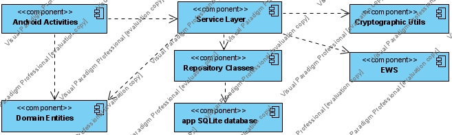
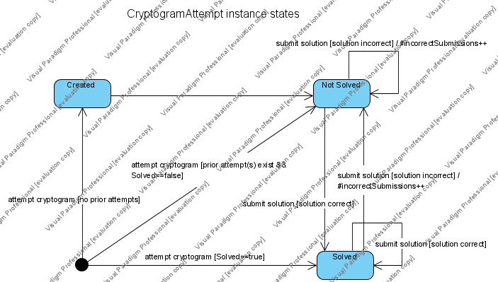
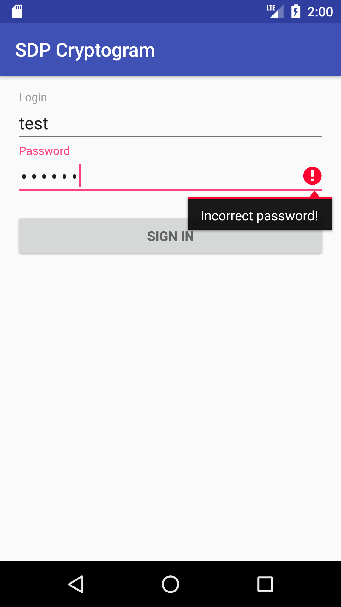
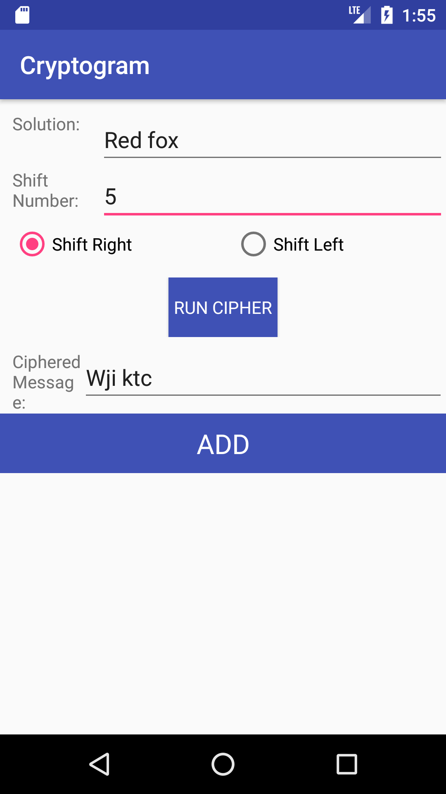
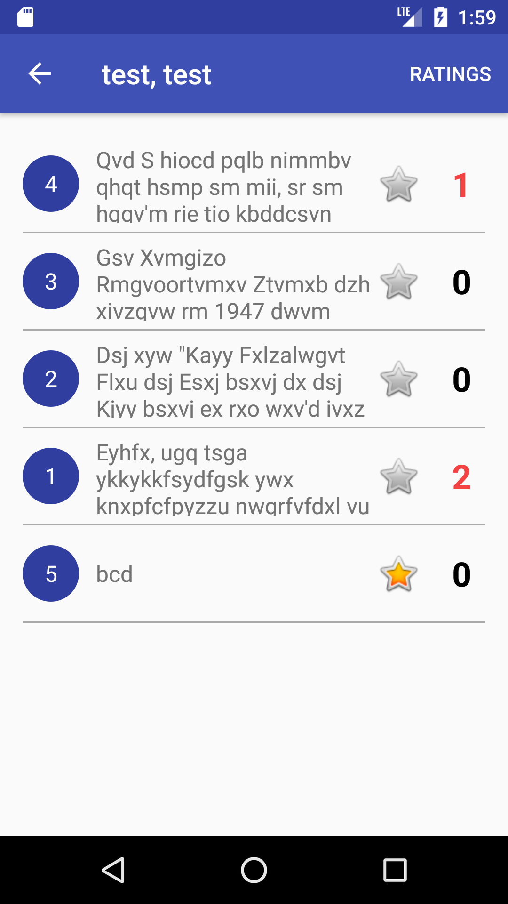

# Design Document

**Author**: Team 20

## 1 Design Considerations

### 1.1 Assumptions

- The application is intended to run on Android phone devices
- The application is dependent on the external web service to allow global data interchange (cryptograms and ratings). It is assumed that the external web service API actually provides facilities exposed by the ExternalWebService proxy class (shown in the class diagram in section 3.1 below) and implemented in the provided ExternalWebService.jar library

### 1.2 Constraints

- The application should use a persistency layer to maintain persistent information across runs. SQLite database shall be used to store persistent information. Support for SQLite databases is, however, included into Android SDK  packages for the Android OS versions the application will support (see also _Supplementary Requirements_ document)
- The application should _not_ rely on any existing databases present on the device (if any). It should take care of installing/upgrading its own database.
- The external web service may become unavailable for various reasons (network outages, connectivity issues, overload, etc.). This has the following implications. 
	* In case a network service is unavailable at the time the application needs to update player's ratings remotely, it is acceptable to update them in the local database only without queuing for later remote update. 
	* In case a network service becomes unavailable at the time the player requests ratings, it is acceptable to present (potentially incorrect) ratings based on local database information only.
	* In case a network service becomes unavailable at the time the administrator saves a new cryptogram it is acceptable to disallow the operation entirely.

### 1.3 System Environment

Hardware

* Typical mobile phones with screen size of around 5" (e.g. Nexus 5X)

Software the application shall run on

* Vanilla Android OS (see _Supplementary Requirements_ document for supported versions) with no extra-packages pre-installed

Software the application shall interact with

* Third-party external web-service represented at application level by the provided ExternalWebService library

## 2 Architectural Design

### 2.1 Component Diagram

The component diagram shows major components of the application and their dependencies. Despite this a simple application, it is not monolithic as follows from the diagram - it has a coherent internal structure.

The main application components are
- EWS (ExternalWebService) - a provided library encapsulating communication details with a remote web service
- Domain Entities - all classes related to domain entities (Player, Cryptogram, CryptogramAttempt)
- Service Layer - encapsulates classes providing access to local database (through Repository classes), cryptographic algorithm and external web service
- Repository classes - a set of classes that define database schema and provide access to underlying database objects, encapsulating database communication details. Domain entities are persisted by means of repository classes 
- Cryptographic Utils - a utility class that implements Simple Substitution Cipher encryption algorithm
- Android Activities - all Android SDK specific classes used by the application (Activities, Intents, Adapters, etc.)
- App SQLite database - physical database file with all application-related data stored on the device

The rationale behind defining the aforementioned architectural view components is three-fold

- to allow for discrete modules that can be tested in isolation via automated tests
- to concentrate core app functionality at and beneath the Service layer which, in tern, internally routes calls to appropriate repositories, EWS or cryptographic utils, combines and/or transform the results before returning to the caller
- to provide uniform interfaces allowing execution components of the app communicate with Service layer classes mainly in terms of domain entities

### 2.2 Deployment Diagram

Since all components of the system (including SQLite database and ExternalWebService library) shall be deployed on a single device (a smartphone), the deployment diagram seems redundant.

## 3 Low-Level Design

### 3.1 Class Diagram

The figure above shows the application design as a UML class diagram. 

### 3.2 Other Diagrams

The Team decided to elaborate over CryptogramAttempt instance lifecycle as a player starts working on it. The result is presented as a UML state diagram.

## 4 User Interface Design

The figures below show prototypes of the following UI components

- User Login form
- Add New Cryptogram form
- Current Player Dashboard (cryptogram list to choose from with currently logged-in player stats shown)

|   Login Form    |   New Cryptogram Form		|   Player Dashboard	|
|:-----------------------------:|:----------------------------:|:----------------------------:|
|       |       |       |
