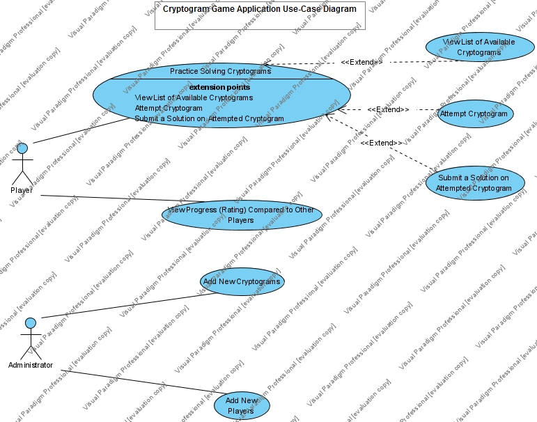

# Use Case Model

**Author**: Team 20

## 1 Use Case Diagram

The actors of the system (administrator and player) are shown above connected to system functionality they require. 

## 2 Use Case Descriptions

### View List of Available Cryptograms

*Requirements*

Req.#10. The application shall allow the player to view a list of all available cryptograms (to attempt a particular cryptogram from)

*Pre-conditions*

- The user is logged-in as a player

*Post-conditions*

- None

**Scenarios**

1. The user performs an action that brings up a list of all available cryptograms. The list shall show, for each cryptogram, its identifier, whether the current player has solved it, and his/her number of incorrect solution submissions if any (Req.#11)

---
### Attempt Cryptogram

*Requirement*

Req.10. The application shall allow the player to choose a cryptogram from a list of all available cryptograms, view the chosen cryptogram (including any prior solution if any), assign or reassign replacement letters (produce a solution) in the puzzle (cipher phrase), _return to the list of cryptograms without submitting a solution_

*Pre-conditions*

- The user is logged-in as a player
- The user observes a list of available cryptograms

*Post-conditions*

- The user observes a list of available cryptograms (the list item with the recently attempted cryptogram remains unchanged)
- Any solution entered by the user on the attempted cryptogram was saved into local database
- The fact of cryptogram attempt has been recorded

**Scenarios**

1. The user picks one cryptogram from a list of available cryptograms
1. The system brings up a cryptogram attempt form with a puzzle phrase and, depending on whether the user has worked on that cryptogram before, 
	
	* The last entered solution phrase (from a previously saved attempt or submission) or empty solution phrase (in case of no previous attempts or submissions)
	* Indication of the prior solution status (solved/submitted) if any
	
1. The user assigns (or reassigns) replacement letters to the encrypted letters of the puzzle and views the result of those assignments
1. The user leaves a cryptogram attempt form (without submitting a solution)

---
### Submit a Solution on Attempted Cryptogram

*Requirement*

Req.10. The application shall allow the player to choose a cryptogram from a list of all available cryptograms, view the chosen cryptogram (including any prior solution if any), assign or reassign replacement letters (produce a solution) in the puzzle (cipher phrase), _submit the current solution when he or she has replaced all letters in the puzzle and is satisfied with such solution_

*Pre-conditions*

- The user is logged-in as a player
- The user observes a list of available cryptograms

*Post-conditions*

- The user observes a list of available cryptograms (the list item with the recently submitted cryptogram got updated indicating the fact of submission)
- Any solution submitted by the user, whether correct or incorrect, on the attempted cryptogram was saved into local database
- The fact of cryptogram submission (#submissions, possibly #incorrect submissions, solved or not) has been recorded/updated into database

*Solution Matching Rule*

The solution phrase supplied is considered correct if it matches the solution phase of the cryptogram in alphabetic characters (non-alphabetic characters are ignored)

**Scenarios**

1. See steps #1-3 from "Attempt Cryptogram" use-case
1. The user submits the solution
1. The system verifies if the solution submitted matches the solution phrase encoded in the cryptogram according to the matching Rule (see above)
1. The user gets notified of the correctness of provided solution (whether the cryptogram was solved or not)
1. The user leaves a cryptogram attempt form

---
### View Progress (Rating) Compared to Other Players

*Requirements*

Req.#2. The application shall allow the player to view the list of player ratings

*Pre-conditions*

- The user is logged-in as a player

*Post-conditions*

- None

**Scenarios**

1. The user performs an action that brings up a list of player ratings. Each list item (for each player) shall display  his or her name, the number of cryptograms solved, the number of cryptograms started, and the total number of incorrect solutions submitted. The list shall be sorted in descending order by the number of cryptograms solved (Req.#12)

---
### Add New Cryptograms

*Requirements*

Req.#3. The application shall allow the administrator to add new cryptograms

*Pre-conditions*

- The user is logged-in with administrator privileges

*Post-conditions*

- New cryptogram is saved into local database (on the device)

**Scenarios**

*Normal*
1. The user performs an action that brings up the form that allows him to:

	* Enter a solution phrase for the cryptogram
	* Choose an encryption key (alphabet shift) that will be used by the encryption algorithm (see also _Supplementary Requirements_ document)
	* Run the cipher to produce a matching encoded phrase (i.e. puzzle/cipher phrase) or enter the encoded phrase manually
	* Edit any of the above information as necessary (Req.#9c)
	* Save the above information as a new cryptogram

1. The system shall perform the following checks on the information entered 
	* Only alphabetic characters are encoded, while other characters (such as punctuation, numbers, or white spaces) remain intact (Req.#7)
	* The encoded phrase and solution phrase match each other after any manual editing
	
1. If the above tests succeed, the system saves cryptogram into local database

1. The user receives a confirmation message containing a unique identifier assigned to the cryptogram

*Exceptional*

1. If any of the tests fail, the user gets notified on the error; no info is saved into database
 

---
### Add New Players

*Requirements*

Req.#3. The application shall allow the administrator to add new local players

*Pre-conditions*

- The user is logged-in with administrator privileges

*Post-conditions*

- New player is saved into local database (on the device)

**Scenarios**

*Normal*

1. The user performs an action that brings up the form that allows him to enter a first name (optional), a last name (optional), and a username of the player
1. The system checks if the user name entered is unique
1. If the username is unique the system saves player info into local database 
1. The user gets notified that the player has been created (or able to see a recently added player in a list players)

*Exceptional*

1. If the username of the player happened to be non-unique, the user is able to see a visual notification of this fact

---
*For each use case in the use case diagram, this section should contain a description, with the following elements:*

- *Requirements: High-level description of what the use case must allow the user to do.*
- *Pre-conditions: Conditions that must be true before the use case is run.*
- *Post-conditions Conditions that must be true once the use case is run.*
- *Scenarios: Sequence of events that characterize the use case. This part may include multiple scenarios, for normal, alternate, and exceptional event sequences. These scenarios may be expressed as a list of steps in natural language or as sequence diagrams.*
