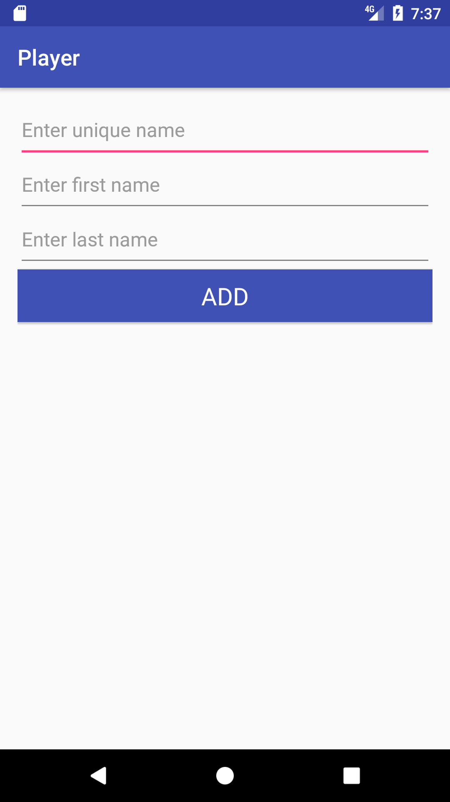
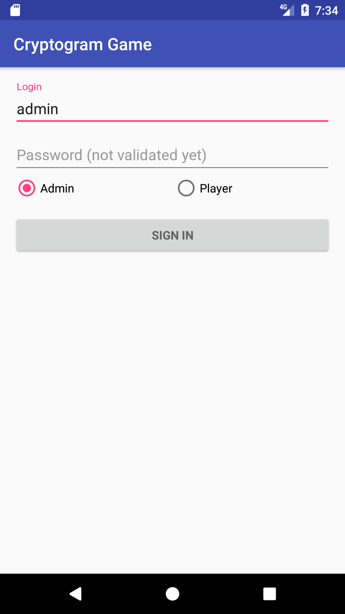

Team 20 User Manual.

Welcome to Cryptogramia  
  
“The Best Cryptogram Game On The Web”

Index:  
  
I. Introduction

II. Downloading the App

III. Logging in as a User

IV. Logging in as an Admin  

V. Super Security

VI. Choosing your very own cryptogram  

VII. What Cryptograms are available?

VIII. Let’s Play!  

IX. Keeping track of new cryptograms

X. Contact Us

I. Introduction:  
  
Hello! Welcome to our Cryptogram Game! Of course we will go over the
basics here before we begin. First I would like to go over what a
Cryptogram is.  
  
The Google definition of a Cryptogram is as follows.  
  
cryp·to·gram

kriptəˌɡram/

*noun*

noun: **cryptogram**; plural noun: **cryptograms**

1.  **1**.a text written in code.

2.  **2**.a symbol or figure with secret or occult significance.

Now that you know what a cryptogram is we are going to now dive into how
our application works and the components of our game.  

II. Downloading the App

Where can you find this app? The application can be found in the app store. First, access your phone and click on the "Google Play Store." Once you have found this you can simply search four our application and download it. The app may take a few seconds to a few minutes to install depending on your network speed. Once downloaded you will be prompted to launch this app. You can then proceed to creating a username and password. 

  
III. Logging In (User)  
  
Please go ahead and go to the login screen and choose a username. This
username will be used throughout the game to verify your player identity
and also to verify your score throughout the game itself. After you have
created your username it will be authenticated against our database.
Every username is unique and can be used to keep track of high scores
and other variables. See the image below.  

  
  
IV. Logging In (Administrator)  
  
Of course to design your own cryptogram for your friends to solve you
must first create your own admin username and password. Once you have
created this you can simply add your friends to solve your puzzles. See
the image below.  
  

V. Super Security

Overall it is evident that it is easy for hackers to retrieve your information these days through various methods. Fear not! We are here for you and we have come up with our custom character password creator. To keep it simple we have included a 5+ character password only desgin. This means that every passoword must be intricate and customized to ensure that your information is safe and secure. 

Another great Security we have is string matching which means only the string/password you use will be stored in our database. This means that different combinations cannot be used by hackers as well as case and special characters. 

VI. Choosing your very own Cryptogram.

Once have successfully logged in you can choose your Cryptogram. You
will be prompted at this time to choose a cryptogram that is available
during that time. At this time we will be using a
simple cipher but that will change in the near future as our technology
advances.

VII. Keeping track of new Cryptograms

New releases will be available in the future. However, for now, we have devised a great cryptogram that is available to try currently. Please give it a go and look for push messages for new releases in the future. The team will be looking forward to you trying our new cryptogram and cipher designs. 

VIII. Let’s Play!  
  
Once you have chosen a username you will be authenticated and logged in
as your chosen user. A screen will ensue and you will see a “Player”
Dashboard. Here you will be able to see who is available and who has
signed up for the cryptogram you have chosen. From here you can play
with friends and solve cryptograms of your choosing.  

IX. Keeping track of new Cryptogram releases.

Sure, old cryptograms get boring! That's why our app automatically 
updates when you log in, retrieving new cryptograms from players around the world.
  
X. Contact Us  
  
Please feel free to contact us to ensure that your game experience is
easy and safe. You can reach us at XXXXXXX. 
  
  
Thanks for Playing!
